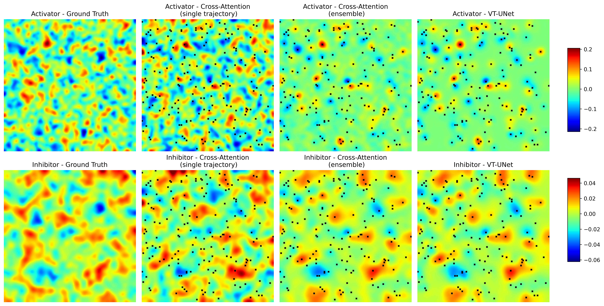
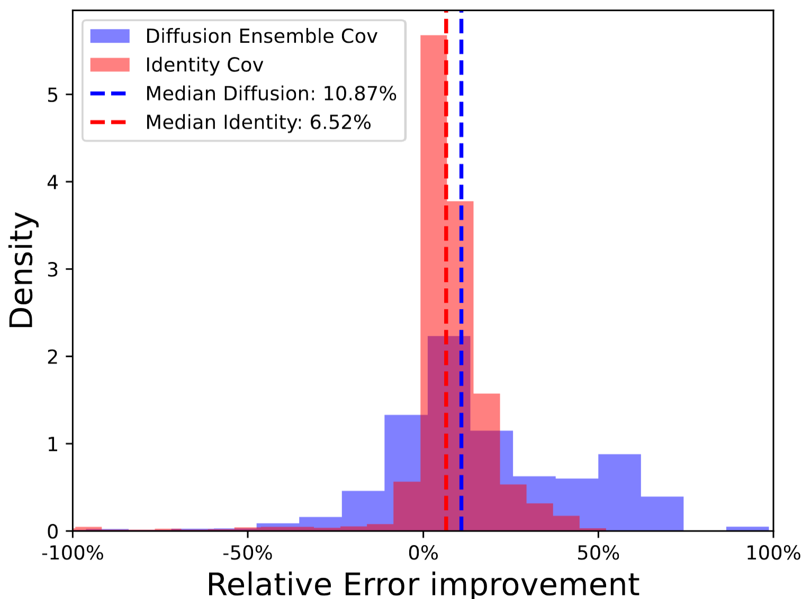

# Diffusion models for field reconstruction
---

Demo: [](https://colab.research.google.com/drive/1RzcvX7jHDVc1VTkyUAe8bRA3C93xEffd?usp=sharing); [](https://huggingface.co/tonyzyl/DiffusionReconstruct)

### Summary of the work

* We propose a cross-attention diffusion model for global field reconstruction.
* We compare different conditioning methods against a strong deterministic baseline and conducted a comprehensive benchmark on the effect of hyperparameters on reconstruction quality.
* The cross-attention diffusion model outperforms others in noisy settings, while the deterministic model is easier to train and excels in noiseless conditions.
* The ensemble mean in probabilistic reconstructions of diffusion model converges to the deterministic output.
* Latent diffusion might be beneficial for handling unevenly distributed fields and to reduce the overall training cost.
* The tested PDEs include Darcy flow, diffusion-reaction, shallow water equations and compressible Navier-Stokes equations.


Tested conditioning methods include:
* Guided Sampling (or inpainting)
* Classifier-Free Guided Sampling (CFG)
* Cross-Attention with the proposed encoding block

<div style="text-align: left;">
  
  <p>Figure 1: Results of diffusion models are computed from an ensemble of 25 trajectories over 20 steps The red dashed line represents the baseline for reconstruction using the mean.</p>
</div>

**Table 1:Comparison of nRMSE and Computation Cost per sample for the Darcy flow, the computation cost of diffusion models are computed from an ensemble of 25 trajectories with predictor-corrector and 20 steps.**
|                                | **Guided Sampling** | **CFG** | **Cross-Attention** | **VT-UNet** | **Numerical** |
|--------------------------------|---------------------|---------|---------------------|-------------|---------------|
| **nRMSE (0.3%)**               | 0.476               | 0.291   | 0.178               | 0.176       | 0.202         |
| **nRMSE (1.37%)**              | 0.474               | 0.261   | 0.129               | 0.092       | 0.180         |
| **Computation cost (s)**       | 0.944               | 0.931   | 1.769               | 0.00206     | 62            |

---
### Proposed measurements encoding block


<div style="text-align: center;">
  
  <p>Figure 2: Schematic of the proposed condition encoding block. For CFG, mean-pooling is performed to reduce the dimensionality and to combine it with the noise scale embedding.</p>
</div>

The Voronoi-tessellated (VT) fields serve as an inductive bias and the proposed condition encoding block integrates the interpolated fields with the sensing positions. The two sources of information are fused using a learnable modulation following the Feature-wise Linear Modulation (FiLM). The refined representation leverages self-attention mechanism to effectively extract the conditioning representation and to establish a mapping between the observed and unobserved regions.

---
### Ability to capture possible realization

<div style="text-align: left;">
  
  <p>Figure 3: Comparison of the generated fields by VT-UNet, single trajectory and ensemble mean of cross-attention diffusion model for the Diffusion Reaction equations with 1% observed data points.</p>
</div>

The diffusion-reaction equation describes the evolution of activator and inhibitor concentration profiles from a Gaussian initialization, governed by a cubic reaction relation. 

The diffusion model, equipped with the proposed encoding block, captures possible realizations, with the mean converging to the deterministic output.

---
### Ensemble sampling for enhancing Data Assimilation(DA)

<div style="text-align: left;">
  
  <p>Figure 4: Histogram of relative error improvement distribution with different DA error covariances on the shallow water equations.</p>
</div>

Overall, both data assimilation methods, whether employing the diffusion ensemble covariance matrix or the identity covariance matrix, enhance the average accuracy of field reconstruction. However, the diffusion ensemble covariance matrix consistently outperforms in the majority of corrections applied to the diffusion model output.

---
### Dataset
**Table 2: Summary of the datasets used in the experiments.**
| **PDE**                        | **$N_d$**       | **$N_t$** | **Boundary Condition** | **Number of Simulations** | **Data Source**                  |
|--------------------------------|-----------------|-----------|------------------------|---------------------------|-----------------------------------|
| Darcy flow                     | $128 \times 128$| N/A       | Dirichlet              | 10,000                    | [Huang et al., 2022](https://doi.org/10.1016/j.jcp.2022.111262) |
| Shallow water                  | $64 \times 64$  | 50        | Periodic               | 250                       | [Cheng et al., 2024](https://doi.org/10.1016/j.jcp.2023.112581) |
| 2D Diffusion reaction          | $128 \times 128$| 101       | Neumann                | 1,000                     | [Takamoto et al., 2022](https://arxiv.org/abs/2210.07182) |
| 2D Compressible Navier Stokes  | $128 \times 128$| 21        | Periodic               | 10,000                    | [Takamoto et al., 2022](https://arxiv.org/abs/2210.07182) |

---
### Installation

We recommend using the virtual environment (Python 3.11) to install the required packages. Using the provided `requirements.txt` file, you can install the dependencies using the following command:

```bash
pip install -r requirements.txt
```

---
### Training

To train the model, once you configure the corresponding config file, you can run the following command (distributed example):

```bash
srun accelerate launch --config_file <path to accelerate config> \
    --multi_gpu \
    --rdzv_backend c10d \
    --machine_rank $SLURM_NODEID \
    --num_machines $SLURM_NNODES \
    --main_process_ip $MASTER_ADDR \
    --main_process_port $MASTER_PORT \
    train_cond.py --config configs/darcy_xattn_config.yaml \
    --conditioning_type=xattn \
    --checkpoints_total_limit=5 \
```

#### Some notes on training:
* When loading from checkpoint, the parameters of EMA are not properly loaded, this is likely a bug of diffusers(v0.29.2), for details on how to fix this, please refer to the discussion in the comments.
* If not loading the dataset in memory, the implemented xarray is not optimized for fetching data from disk.
* The training script follows the diffusers example, which only save the optimization state of the main process, for proper loading from checkpoint, one should save/load all the states of the processes.